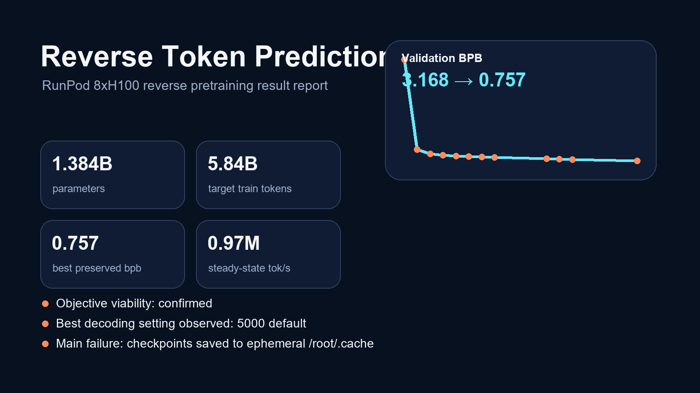

# Reverse Token Prediction

<p align="center">
  
</p>

<p align="center">
  <a href="docs/results/reverse_runpod_8xh100_report.md"></a>
  <a href="docs/results/Reverse_Token_Prediction_Results_2026-04-29.pptx"></a>
  <a href="docs/results/reverse_runpod_8xh100_apr2026.json"></a>
</p>

Reverse Token Prediction trains a causal language model on text in the opposite direction. Instead of learning `prefix -> next token`, the core experiment learns `suffix -> previous token`. At inference time, you provide an ending anchor and the model generates the text that plausibly leads into that ending.

This repo contains both:

- the original local reverse-only research prototype in [`reverse_token_prediction_lab.py`](reverse_token_prediction_lab.py)
- the higher-throughput `nanochat` fork in [`nanochat_reverse/`](nanochat_reverse/) used for the 8xH100 RunPod experiment

## April 2026 Result

The main 8xH100 RunPod experiment produced a real result:

- `1.384B` parameters
- `5.84B` target train tokens
- reverse validation improved from `3.1675 bpb` to `0.7575 bpb`
- steady-state terminal transcript showed roughly `0.95M-0.98M tok/s`
- the reverse objective clearly learned anchor landing and topic lead-ins

The weights were lost near the end of the run when the remote container restarted, because checkpoints had been written to ephemeral `/root/.cache` instead of the persistent `/workspace` volume. The repo now defaults reverse runs to `/workspace/nanochat_reverse` when `/workspace` is present, so the failure mode that killed this run is fixed in the codebase.

## Evidence

<p align="center">
  
</p>

<p align="center">
  
</p>

High-level read:

- the validation curve kept moving well past the halfway point
- checkpoint probes at `3000`, `4000`, and `5000` confirmed the reverse objective was real
- `5000` default decoding was the best observed balance
- lower temperature increased looping; higher temperature reduced loops but increased hallucination

## Artifacts

- [Full experiment report](docs/results/reverse_runpod_8xh100_report.md)
- [Presentation deck (.pptx)](docs/results/Reverse_Token_Prediction_Results_2026-04-29.pptx)
- [Structured result record (.json)](docs/results/reverse_runpod_8xh100_apr2026.json)
- [Surviving zipped launch log](docs/reverse_8xh100_from_zip.log)
- [RunPod reverse runbook](docs/nanochat_reverse_h100.md)
- [Original experiment rationale](docs/reverse_training_idea.md)

## Core Idea

Normal causal LM:

```text
input:  x0 x1 x2 ...
target: x1 x2 x3 ...
```

Reverse causal LM:

```text
input:  xT xT-1 xT-2 ...
target: xT-1 xT-2 xT-3 ...
```

Displayed generation is reversed back into normal reading order, so a suffix like:

```text
the experiment proved the point.
```

can produce a paragraph that leads into that ending.

## H100 Quick Start

On a Linux H100 box:

```bash
git clone https://github.com/MalyisGreat/Reverse-Token-Prediction.git
cd Reverse-Token-Prediction

bash scripts/setup_h100_env.sh
source .venv/bin/activate

# Short correctness check.
bash scripts/smoke_test.sh

# Full reverse-only 100M run. Defaults target 3B tokens.
bash scripts/train_h100_reverse_100m.sh
```

For a single-H100 budget run, use the older speedrun path:

```bash
TARGET_TOKENS=1000000000 bash scripts/runpod_h100_speedrun.sh
```

## Nanochat 8xH100 Reverse Run

For the full nanochat-based run on an 8xH100 RunPod node, use the official RunPod PyTorch template. If entering a Docker image manually, use `runpod/pytorch:1.0.3-cu1290-torch291-ubuntu2204`.

```bash
git clone https://github.com/MalyisGreat/Reverse-Token-Prediction.git
cd Reverse-Token-Prediction/nanochat_reverse
WANDB_RUN=dummy \
screen -L -Logfile reverse_8xh100.log -S reverse-nanochat-8x \
  bash runs/reverse_speedrun_8xh100.sh
```

Reverse run scripts now default to `/workspace/nanochat_reverse` when `/workspace` exists and is writable. That keeps checkpoints on the persistent volume on hosted GPU pods. To override it explicitly:

```bash
export NANOCHAT_BASE_DIR=/workspace/nanochat_reverse
```

This uses nanochat's training stack with a minimal reverse objective patch:

```text
input:  <|bos|> xT xT-1 xT-2 ...
target:         xT-1 xT-2 xT-3 ...
```

For a 5xH100 fallback:

```bash
cd nanochat_reverse
screen -L -Logfile reverse_5xh100.log -S reverse-nanochat-5x \
  bash runs/reverse_speedrun_5xh100.sh
```

See [docs/nanochat_reverse_h100.md](docs/nanochat_reverse_h100.md) for launch knobs, persistence defaults, checkpoint locations, and reverse-generation commands.

W&B is optional. Leave `WANDB_RUN` unset or set `WANDB_RUN=dummy` to use terminal logs only. Watch and sample with:

```bash
cd Reverse-Token-Prediction/nanochat_reverse
MODEL_TAG=reverse_d24_ratio8 bash runs/reverse_watch.sh
MODEL_TAG=reverse_d24_ratio8 bash runs/reverse_loss.sh
MODEL_TAG=reverse_d24_ratio8 ANCHOR="and that was the strange part." bash runs/reverse_sample.sh
MODEL_TAG=reverse_d24_ratio8 bash runs/reverse_history_probe.sh
```

## H100 Attention Benchmark

Before committing to a long run on a new machine, run:

```bash
bash scripts/bench_h100_attention.sh
```

It compares:

- full multi-head global attention
- GQA global attention
- GQA plus Gemma-style local/global attention

Use the last `tok/s` lines in `logs/bench_h100_attention/*.log` to choose the launch profile.

## Resume

Resume a checkpoint and add more tokens:

```bash
RESUME=runs_h100_reverse_100m/reverse_only/last.pt \
ADDITIONAL_TOKENS=3000000000 \
bash scripts/resume_h100_reverse_100m.sh
```

The resume script reads the checkpoint step and computes the absolute `--steps_per_experiment` target automatically.

## Sample

```bash
CHECKPOINT=runs_h100_reverse_100m/reverse_only/best.pt \
PROMPT=" the result was clear." \
bash scripts/sample_reverse.sh
```

The prompt is an ending anchor, not a chat message. Good anchors look like full sentence endings:

```text
 the result was clear.
 and that was the strange part.
 therefore the answer is Paris.
```

Bare anchors like `42` are intentionally weak and tend to produce bibliography/date/table-shaped text.

## Files

- `reverse_token_prediction_lab.py` - single-file trainer/evaluator/generator
- `scripts/setup_h100_env.sh` - Python environment setup
- `scripts/prepare_token_bin.sh` - build a local uint16/uint32 token binary for fast training
- `scripts/runpod_h100_speedrun.sh` - install, prepare token bin, benchmark, and launch a budget H100 run
- `scripts/train_h100_reverse_100m.sh` - H100 from-scratch reverse-only training
- `scripts/resume_h100_reverse_100m.sh` - H100 continuation training
- `scripts/bench_h100_attention.sh` - quick H100 throughput comparison for attention variants
- `scripts/smoke_test.sh` - toy local correctness check
- `scripts/sample_reverse.sh` - suffix-conditioned generation
- `docs/reverse_training_idea.md` - experiment rationale and expected behavior
- `docs/results/` - report, deck, data, and visual result artifacts
- `nanochat_reverse/` - vendored nanochat with `--reverse-training` plus 5xH100 and 8xH100 launch scripts

## Notes

This is not an instruction/chat model. It is a suffix-conditioned reverse language model. For answer-to-reasoning experiments, fine-tune on data formatted like:

```text
Question: ...
Reasoning: ...
Therefore, the answer is ...
```

Then sample backward from the final answer line and validate the generated trace separately.
