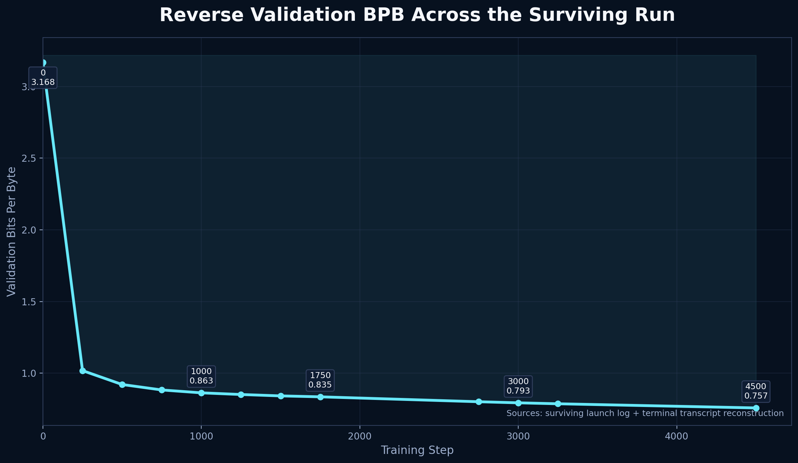
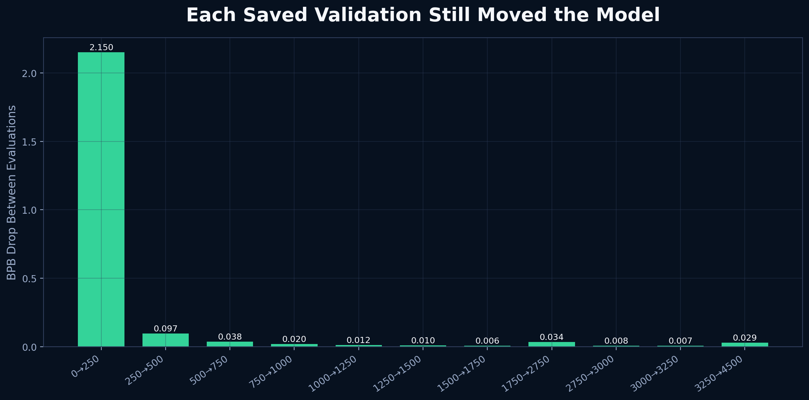
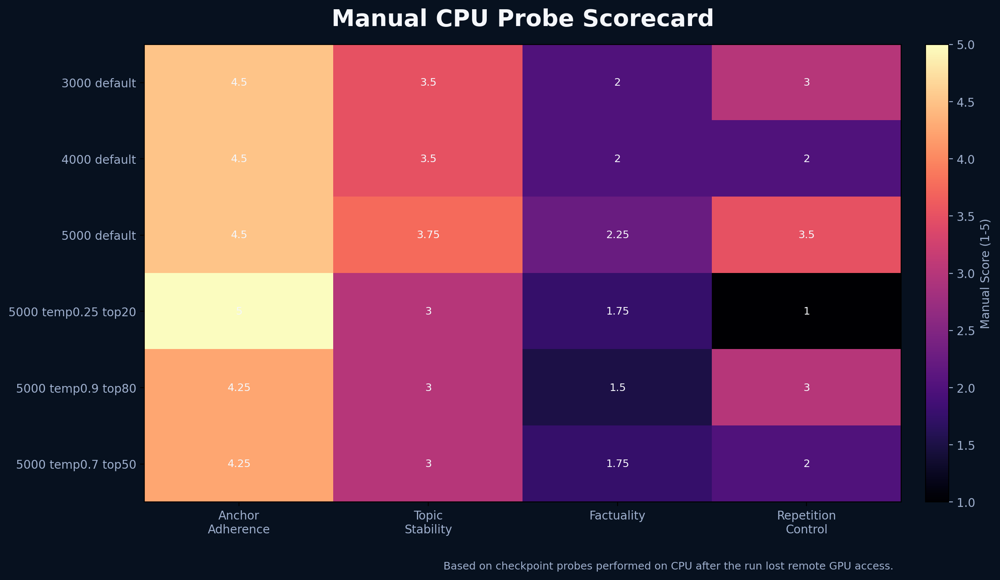

# Reverse Token Prediction on 8xH100

This report reconstructs the strongest surviving evidence from the April 29 2026 RunPod experiment. The trained weights were lost after the remote container restarted near the end of the run, but the repo, the launch logfile, the terminal validation checkpoints, and the CPU probe transcript were preserved well enough to produce a defensible result package.

## Executive Summary

- **Objective status:** worked
- **Model class:** reverse-only causal transformer trained on BOS + reversed token rows
- **Observed scale:** `1.384B` parameters, `5.84B` target train tokens, `2,048` context
- **Best preserved validation:** `0.757458 bpb` at step `4500`
- **Observed decoding verdict:** `5000` default decoding was the best balance across anchor landing, topicality, and loop control
- **Failure mode:** checkpoints were saved under `/root/.cache/nanochat_reverse`, so the weights disappeared when the container restarted and only `/workspace` survived

## Artifact Inventory

- [Structured result record](reverse_runpod_8xh100_apr2026.json)
- [Presentation deck](Reverse_Token_Prediction_Results_2026-04-29.pptx)
- [Validation curve](assets/validation_curve.png)
- [Validation interval improvements](assets/validation_improvements.png)
- [Checkpoint probe scorecard](assets/probe_tradeoffs.png)
- [GitHub hero image](assets/github_hero.png)
- [Surviving launch log](../reverse_8xh100_from_zip.log)

## What Survived

The surviving evidence came from two different places:

1. **The zipped launch log** preserved:
   - environment setup
   - hardware configuration
   - model config
   - parameter counts
   - target token budget
   - the first validation point
   - the first `201` training steps
2. **The terminal transcript** preserved:
   - later validation checkpoints
   - steady-state throughput snapshots
   - CPU probe outputs for checkpoints `3000`, `4000`, and `5000`
   - decoding comparisons across default, lower-temperature, and higher-temperature settings

The structured JSON in this folder separates those sources explicitly instead of flattening them into one synthetic log.

## Run Configuration

| Field | Value |
| --- | --- |
| Hardware | 8x NVIDIA H100 80GB HBM3 |
| Model tag | `reverse_d24_ratio8` |
| Parameters | `1,384,122,122` |
| Sequence length | `2048` |
| Depth | `24` |
| Heads | `12` |
| KV heads | `12` |
| Embedding width | `1536` |
| Save cadence | every `1000` steps |
| Validation cadence | every `250` steps |
| Target train tokens | `5,838,471,168` |

The surviving log also recorded that the observed model config used `window_pattern = "SSSL"`, while startup warned that Flash Attention 3 was unavailable and SDPA fallback would be inefficient for sliding-window attention. Even with that warning, the later terminal transcript showed a much stronger steady-state throughput band than the first `201` logged steps.

## Validation Trajectory

Reconstructed preserved validation checkpoints:

| Step | Validation bpb | Source |
| --- | --- | --- |
| `0` | `3.167509` | surviving launch log |
| `250` | `1.017722` | terminal transcript |
| `500` | `0.920829` | terminal transcript |
| `750` | `0.882878` | terminal transcript |
| `1000` | `0.862738` | terminal transcript |
| `1250` | `0.851184` | terminal transcript |
| `1500` | `0.841446` | terminal transcript |
| `1750` | `0.834959` | terminal transcript |
| `2750` | `0.800716` | terminal transcript |
| `3000` | `0.793115` | terminal transcript |
| `3250` | `0.786521` | terminal transcript |
| `4500` | `0.757458` | terminal transcript |

Two things matter here:

- the curve did not flatten early
- the late checkpoints still moved by useful amounts

That makes this a real optimization result, not a noisy artifact from the first few hundred steps.

## Incremental Improvement

After the initial collapse from step `0` to `250`, the run continued to extract smaller but still non-trivial improvements. The largest late preserved drop was between `1750` and `2750`, but every later interval that survived in the transcript still moved in the right direction.

## Throughput

The throughput evidence is split:

- the surviving logfile only captured the first `201` training steps
- the later terminal transcript captured the run after it had settled

### Early steps from the surviving log

- logged step range: `0` to `200`
- median tok/s after step `20`: `560,733`
- max tok/s after step `20`: `562,445`
- median BF16 MFU after step `20`: `33.84`

### Later terminal transcript snapshots

| Step | tok/s | BF16 MFU |
| --- | --- | --- |
| `352` | `971,856` | `58.66` |
| `400` | `969,874` | `58.54` |
| `1282` | `976,611` | `58.94` |
| `1321` | `981,352` | `59.23` |
| `1336` | `949,344` | `57.30` |
| `1366` | `965,518` | `58.27` |

That later window shows the run settling into roughly `0.95M-0.98M tok/s` at around `58-59%` BF16 MFU. The run clearly moved well beyond the cold-start/setup behavior preserved in the logfile.

## Checkpoint Probe Analysis

The checkpoint probes were done on CPU after the GPU run had already been disrupted, so they should be read as qualitative behavior checks rather than benchmark-grade evals.

### Manual judgment summary

| Probe | Short read |
| --- | --- |
| `3000 default` | First checkpoint that clearly looked non-random and useful for reverse landing |
| `4000 default` | Some anchors became cleaner, but repetition became much more obvious |
| `5000 default` | Best overall compromise |
| `5000 temp0.25 top20` | Too deterministic; strong local loops |
| `5000 temp0.9 top80` | Escaped some loops, but hallucinated harder |
| `5000 temp0.7 top50` | Not better than default |

### What the probes imply

- The reverse objective definitely learned **anchor landing**.
- Topic steering improved materially between `3000` and `5000`.
- **Factuality** lagged behind anchor adherence.
- Temperature tuning alone does not solve the model's failure mode.
- The next quality lever is likely **repetition control** or **reverse scoring / reranking with a forward model**, not just more random decoding.

## Best Supported Claim

The strongest claim supported by the surviving evidence is:

> Reverse-only pretraining at nanochat scale is viable as a suffix-conditioned language modeling objective. It meaningfully improves anchor landing and topic lead-in generation, but it does not yet deliver factual reconstruction at this parameter/data scale.

That is a good result. It upgrades the idea from an untested intuition to a working training objective with visible qualitative behavior and a clean held-out loss trajectory.

## Failure and Postmortem

The failure was operational, not scientific.

### What happened

- The run reached about `99.69%` completion.
- The remote RunPod container restarted.
- The persistent volume preserved `/workspace`.
- The checkpoints had been written under `/root/.cache/nanochat_reverse`.
- The new container no longer had `/root/.cache`.
- Searches for `model_*.pt`, `meta_*.json`, and `optim_*.pt` under `/root` and `/workspace` returned nothing.

### What was lost

- trained checkpoints
- metadata sidecars
- optimizer state

### What was retained

- source code
- launch scripts
- the surviving launch logfile
- later terminal transcript checkpoints
- checkpoint probe observations

## Repo Changes After the Incident

This repo now defaults reverse scripts to `/workspace/nanochat_reverse` when `/workspace` exists and is writable. That covers the persistence failure mode that killed the original run.

Patched files:

- [`nanochat_reverse/nanochat/common.py`](../../nanochat_reverse/nanochat/common.py)
- [`nanochat_reverse/runs/reverse_speedrun_8xh100.sh`](../../nanochat_reverse/runs/reverse_speedrun_8xh100.sh)
- [`nanochat_reverse/runs/reverse_sample.sh`](../../nanochat_reverse/runs/reverse_sample.sh)
- [`nanochat_reverse/runs/reverse_history_probe.sh`](../../nanochat_reverse/runs/reverse_history_probe.sh)
- [`nanochat_reverse/runs/reverse_loss.sh`](../../nanochat_reverse/runs/reverse_loss.sh)
- [`nanochat_reverse/runs/reverse_watch.sh`](../../nanochat_reverse/runs/reverse_watch.sh)

## Recommended Next Run

If this experiment is rerun, the minimum safer sequence is:

1. launch with `/workspace/nanochat_reverse` as the checkpoint base dir
2. tee the long run to a logfile under `/workspace`
3. tar the checkpoint directory as soon as `model_5000.pt` or the final checkpoint exists
4. keep the `3000`, `4000`, `5000`, and final probes as part of the runbook
5. evaluate decoding with repetition control, not just temperature sweeps

## Bottom Line

The trained weights were lost, but the experiment itself was not empty. The surviving evidence is strong enough to show that:

- the reverse objective is real
- it scales past a toy local model
- it continues improving well into a multi-billion-token run
- the main remaining problem is output quality and operational reliability, not whether the core idea works
